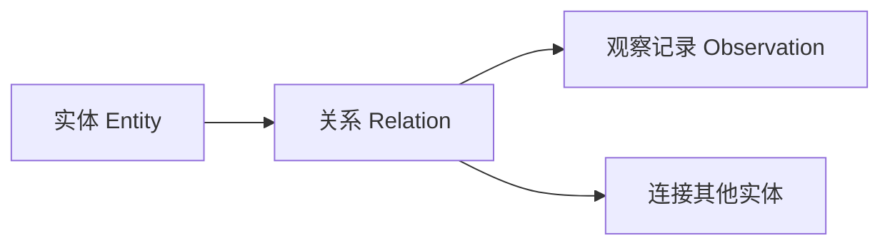
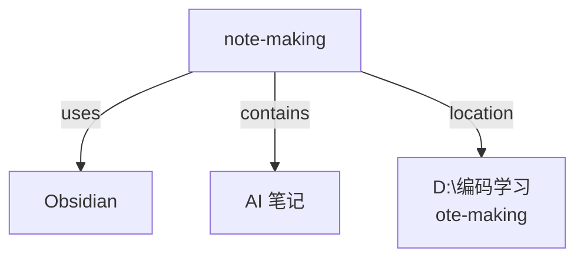

# Claude Code Memory MCP 使用指南

## 什么是 Memory MCP？

Memory MCP 是一个**知识图谱记忆系统**，让 AI 能够跨会话记住信息。它将信息存储为**实体 (Entity)** 和**关系 (Relation)** 的网络结构。

## 核心概念



| 概念 | 说明 | 示例 |
|-----|------|------|
| **实体 Entity** | 存储的对象 | 用户、项目、技术栈 |
| **关系 Relation** | 实体之间的连接 | "使用"、"属于"、"创建" |
| **观察 Observation** | 关于实体的具体信息 | "用户偏好使用 TypeScript" |

---

## 工具详解

### 1. 创建实体 `create_entities`

> [!tip] 用途
> 创建新的知识节点

```json
{
  "entities": [
    {
      "name": "note-making",
      "entityType": "project",
      "observations": ["这是一个 Obsidian 笔记库", "使用 Markdown 格式"]
    }
  ]
}
```

### 2. 创建关系 `create_relations`

> [!tip] 用途
> 连接两个实体，建立关联

```json
{
  "relations": [
    {
      "from": "note-making",
      "to": "Obsidian",
      "relationType": "uses"
    }
  ]
}
```

### 3. 添加观察 `add_observations`

> [!tip] 用途
> 为已有实体添加新信息

```json
{
  "observations": [
    {
      "entityName": "note-making",
      "contents": ["包含 AI 相关笔记", "使用中文编写"]
    }
  ]
}
```

### 4. 读取图谱 `read_graph`

> [!tip] 用途
> 获取整个知识图谱的所有内容

```json
{}
```

### 5. 搜索节点 `search_nodes`

> [!tip] 用途
> 根据关键词搜索实体和观察

```json
{
  "query": "Obsidian"
}
```

### 6. 打开节点 `open_nodes`

> [!tip] 用途
> 获取指定实体的详细信息

```json
{
  "names": ["note-making", "Obsidian"]
}
```

### 7. 删除操作

| 工具 | 作用 |
|-----|------|
| `delete_entities` | 删除实体及其所有关系 |
| `delete_observations` | 删除特定观察记录 |
| `delete_relations` | 删除关系 |

---

## 实际使用示例

假设我想记住项目信息：



步骤：

1. **创建实体**: note-making (项目), Obsidian (工具), TypeScript (技术)
2. **创建关系**: note-making --uses--> Obsidian
3. **添加观察**: "用户偏好中文", "项目位于 D:\编码学习\note-making"

下次会话时，调用 `read_graph` 或 `search_nodes` 找回这些信息。

---

## 与其他记忆工具对比

### Memory MCP vs Memorix

| 特性 | Memory MCP | Memorix |
|-----|-----------|---------|
| 存储结构 | 知识图谱 | 向量数据库 + SQLite |
| 搜索方式 | 节点搜索 | 语义搜索 |
| 适用场景 | 结构化知识 | 会话上下文记忆 |
| 复杂度 | 简单 | 功能更丰富 |

### Memory MCP vs claude-mem

| 特性 | Memory MCP | claude-mem |
|-----|-----------|------------|
| 安装方式 | npx 一键安装 | 需要全局安装 |
| 存储位置 | 内存文件 | SQLite + Chroma |
| Web UI | 无 | 有 (端口 37777) |
| 自动记录 | 无 | 有 (通过 hooks) |

---

## 配置方法

在 `~/.claude.json` 中添加：

```json
{
  "mcpServers": {
    "memory": {
      "command": "cmd",
      "args": ["/c", "npx", "-y", "@modelcontextprotocol/server-memory"],
      "env": {},
      "type": "stdio"
    }
  }
}
```

---

## 如何在 Claude Code 中调用 MCP 工具

### 方法 1：自然语言（推荐）

只需用日常语言描述需求，AI 会自动选择合适的工具：

| 你说 | AI 调用的工具 |
|-----|-------------|
| "查看记忆图谱" | `read_graph` |
| "搜索 Obsidian" | `search_nodes` |
| "记住这个信息" | `create_entities` / `add_observations` |
| "连接这两个实体" | `create_relations` |

### 方法 2：明确指定工具

```
"调用 read_graph"
"使用 search_nodes 搜索 '项目'"
"用 create_entities 创建实体"
```

### MCP 工具命名规则

```
mcp__服务器名__工具名
      │         │
      │         └── read_graph, search_nodes 等
      └── memory (配置的服务器名称)
```

---

## 相关链接

- [[Claude Code 插件管理]]
- [[MCP 服务器配置]]
- [Model Context Protocol 官方文档](https://modelcontextprotocol.io/)

---

> [!note] 创建日期
> 2026-03-01
