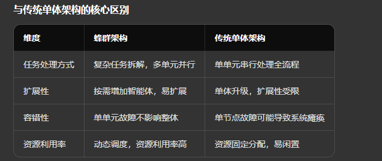

该架构是借鉴蜜蜂蜂群分工协作、自主协同的特性设计的技术架构，核心是由多个功能独立的智能体 / 模块组成分布式协作体系，替代传统的单体式架构，实现复杂任务的高效拆解、并行执行与动态优化，以下是技术领域蜂群架构的核心解读：
核心设计理念
模仿自然蜂群 “蜂王统筹、工蜂分工、相互协作” 的模式，架构中无单一核心控制点，而是由多个具备专属功能的智能体 / 模块组成，各单元自主完成本职工作，同时通过协同机制实现信息互通、任务衔接，形成 “感知 — 决策 — 执行” 的闭环，解决传统单体架构处理复杂任务时效率低、扩展性差、容错性弱的问题。
核心特征（以 AI / 基础设施领域为例）
1. 角色分工明确：每个智能体对应专属功能，如同蜂群中的蜂王、工蜂、雄蜂，例如无问芯穹的基础设施智能体蜂群中，有负责模型匹配的技术哨兵智能体、负责环境管理的平台管家智能体、负责成本优化的资源运营智能体等25；Kimi K2.5 的 Agent Swarm 架构中，子智能体可分别扮演代码审计员、数据分析师、视觉设计师等角色4。
2. 并行协作高效：将复杂宏观任务实时拆解为多个子任务，由不同智能体并行执行，而非传统的串行接力，如同上万只工蜂同时完成采蜜、筑巢、哺育等工作，大幅提升任务处理效率。例如 Kimi K2.5 可生成多达 100 个子智能体并行工作，打破单体模型的算力和效率瓶颈4。
3. 动态自适应优化：架构可根据任务需求、资源状态实时调整智能体的协作方式，例如资源运营智能体可根据 GPU 利用率、任务排队时长动态调度算力资源，避免闲置或挤兑25；同时支持跨地域、跨组件的协同管控，适配不同业务场景的变化。
4. 高度自治与容错：各智能体独立运行，单个单元故障不会导致整个架构瘫痪，如同蜂群中部分工蜂受损不影响整体运作，架构可自动触发容错机制（如重试、备用智能体切换），提升系统可靠性6。
典型应用场景
5. AI 基础设施运维：无问芯穹的基础设施智能体蜂群，通过多智能体协同整合算力调度、集群运维、安全管控等功能，实现基础设施全生命周期的智能化管理，让算力平台从 “被动供资源” 变为 “主动服务业务”，运维能力实现百倍提升25。
6. 大模型任务处理：Kimi K2.5 的 Agent Swarm 架构，通过子智能体并行协作处理超长文本分析、多模态创作、复杂财务审计等单体模型难以高效完成的任务，解决注意力漂移、逻辑崩塌等问题4。
7. 企业级业务自动化：360 的蜂群系统将信息采集、数据清洗、舆情分析、报告生成等环节拆解为不同智能体的工作，通过任务编排实现全流程自动化，打造面向生产场景的 “AI 团队”

简单来说，蜂群架构的核心是 **“分而治之，协同共赢”**，通过多个专业单元的协作，实现 “1+1>2” 的效果，目前已成为 AI、云计算、基础设施运维等领域的重要技术范式，适用于处理高复杂度、高并发、需要多环节协同的任务场景。